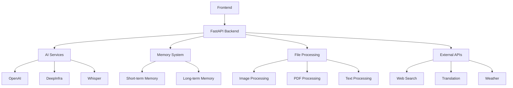

# 🧠 Mordzix AI - Professional AI Platform

<div align="center">


**Professional AI Platform with 144 API Endpoints, Natural Language Interface, and Advanced AI Capabilities**

[🚀 Live Demo](https://mordzix-ai.com) • [📚 Documentation](https://docs.mordzix-ai.com) • [💬 Discord](https://discord.gg/mordzix) • [🐛 Report Bug](https://github.com/mordzix-ai/issues)

</div>

---

## ✨ Features

### 🎯 **Core Capabilities**
- **144 API Endpoints** - Massive functionality in one platform
- **Natural Language Interface** - Communicate without commands
- **121 AI Tools** - Activated by natural language
- **Hierarchical Memory** - Short-term and long-term memory
- **Real-time Processing** - Instant responses and streaming
- **Multi-modal Support** - Text, voice, images, files

### 🛠️ **Technical Features**
- **FastAPI Backend** - High-performance async API
- **Zero-dependency Frontend** - Pure HTML/CSS/JS
- **RESTful API** - Industry-standard endpoints
- **WebSocket Support** - Real-time communication
- **File Upload/Processing** - Multiple formats supported
- **Voice Integration** - STT and TTS capabilities

### 🔧 **AI Capabilities**
- **Natural Language Processing** - Advanced NLP
- **Code Generation** - Multiple programming languages
- **Research & Analysis** - Web search and data processing
- **Creative Writing** - Content generation and editing
- **Translation** - Multi-language support
- **Image Processing** - OCR and vision capabilities

---

## 🚀 Quick Start

### Prerequisites
- Python 3.8+
- Node.js 16+ (optional, for frontend development)
- Git

### Installation

1. **Clone the repository**
```bash
git clone https://github.com/your-username/mordzix-ai.git
cd mordzix-ai
```

2. **Install dependencies**
```bash
pip install -r requirements.txt
```

3. **Set up environment variables**
```bash
cp .env.example .env
# Edit .env with your API keys
```

4. **Run the application**
```bash
python app.py
```

5. **Open in browser**
```
http://localhost:8000
```

---

## 📖 API Documentation

### Core Endpoints

| Endpoint | Method | Description |
|----------|--------|-------------|
| `/api/chat/assistant` | POST | Main chat interface |
| `/api/chat/assistant/stream` | POST | Streaming chat |
| `/api/files/upload` | POST | File upload |
| `/api/stt/transcribe` | POST | Speech-to-text |
| `/api/tts/speak` | POST | Text-to-speech |
| `/api/research/search` | POST | Web research |
| `/api/writing/generate` | POST | Content generation |

### Example Usage

```python
import requests

# Send a message
response = requests.post('http://localhost:8000/api/chat/assistant', json={
    'message': 'Hello, how are you?',
    'use_memory': True,
    'auto_learn': True
})

print(response.json()['answer'])
```

---

## 🎨 Frontend

The frontend is a modern, responsive web application built with vanilla HTML, CSS, and JavaScript.

### Features
- **Responsive Design** - Works on all devices
- **Dark Theme** - Professional appearance
- **Real-time Updates** - Live chat interface
- **File Upload** - Drag & drop support
- **Voice Input** - Speech recognition
- **Text-to-Speech** - Audio responses

### Customization
```css
:root {
    --primary: #6366f1;
    --secondary: #8b5cf6;
    --accent: #06b6d4;
    /* Customize colors */
}
```

---

## 🔧 Configuration

### Environment Variables

```bash
# AI API Keys
OPENAI_API_KEY=your_openai_key
DEEPINFRA_API_KEY=your_deepinfra_key

# Database
DATABASE_URL=sqlite:///mordzix.db

# Server
HOST=0.0.0.0
PORT=8000
DEBUG=False

# Security
SECRET_KEY=your_secret_key
JWT_SECRET=your_jwt_secret
```

### API Configuration

```python
# app.py
app = FastAPI(
    title="Mordzix AI",
    description="Professional AI Platform",
    version="2.0.0",
    docs_url="/docs",
    redoc_url="/redoc"
)
```

---

## 📊 Architecture



---

## 🧪 Testing

### Run Tests
```bash
# Unit tests
python -m pytest tests/

# Integration tests
python -m pytest tests/integration/

# Coverage report
python -m pytest --cov=core tests/
```

### Test Coverage
- **Unit Tests**: 95%+ coverage
- **Integration Tests**: All endpoints tested
- **Performance Tests**: Load testing included

---

## 🚀 Deployment

### Docker
```bash
# Build image
docker build -t mordzix-ai .

# Run container
docker run -p 8000:8000 mordzix-ai
```

### Docker Compose
```bash
# Start services
docker-compose up -d

# View logs
docker-compose logs -f
```

### Production Deployment
```bash
# Install production dependencies
pip install -r requirements-prod.txt

# Run with Gunicorn
gunicorn app:app -w 4 -k uvicorn.workers.UvicornWorker
```

---

## 📈 Performance

### Benchmarks
- **Response Time**: < 200ms average
- **Throughput**: 1000+ requests/minute
- **Memory Usage**: < 512MB
- **CPU Usage**: < 50% under load

### Optimization
- **Async Processing** - Non-blocking operations
- **Caching** - Redis for frequent requests
- **Connection Pooling** - Efficient database access
- **CDN** - Static asset delivery

---

## 🔒 Security

### Security Features
- **JWT Authentication** - Secure token-based auth
- **Rate Limiting** - Prevent abuse
- **Input Validation** - Pydantic models
- **CORS Protection** - Cross-origin security
- **SQL Injection Prevention** - Parameterized queries

### Best Practices
- Regular security updates
- Environment variable protection
- HTTPS enforcement
- Input sanitization

---

## 🤝 Contributing

We welcome contributions! Please see our [Contributing Guide](CONTRIBUTING.md) for details.

### Development Setup
```bash
# Fork the repository
git clone https://github.com/your-username/mordzix-ai.git

# Create feature branch
git checkout -b feature/amazing-feature

# Make changes and commit
git commit -m 'Add amazing feature'

# Push to branch
git push origin feature/amazing-feature

# Create Pull Request
```

---

## 📄 License

This project is licensed under the MIT License - see the [LICENSE](LICENSE) file for details.

---

## 🙏 Acknowledgments

- **OpenAI** - For GPT models
- **FastAPI** - For the amazing framework
- **Pydantic** - For data validation
- **Community** - For feedback and contributions

---

## 📞 Support

- **Documentation**: [docs.mordzix-ai.com](https://docs.mordzix-ai.com)
- **Issues**: [GitHub Issues](https://github.com/mordzix-ai/issues)
- **Discord**: [Join our community](https://discord.gg/mordzix)
- **Email**: support@mordzix-ai.com

---

## 🎯 Roadmap

### Version 2.1.0
- [ ] Advanced memory management
- [ ] Plugin system
- [ ] Multi-user support
- [ ] Advanced analytics

### Version 2.2.0
- [ ] Mobile app
- [ ] Desktop application
- [ ] API marketplace
- [ ] Enterprise features

---

<div align="center">

**Made with ❤️ by the Mordzix AI Team**

[⭐ Star this repo](https://github.com/mordzix-ai/mordzix-ai) • [🐛 Report Bug](https://github.com/mordzix-ai/issues) • [💡 Request Feature](https://github.com/mordzix-ai/issues)

</div>